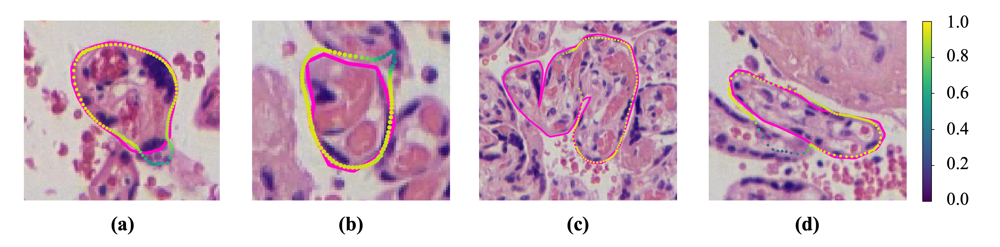
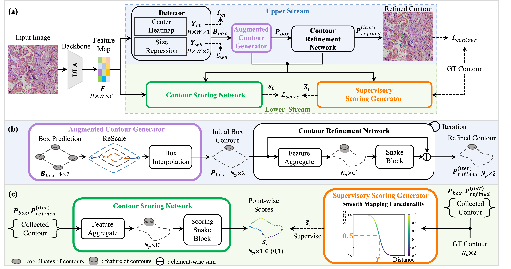

# SSnake

[]() []()

> [Augmented contour scoring snake for instance segmentation of placental separable villi](https://10.1016/j.bspc.2024.106713)
>
> Yiming Liu, Xiang Tao, Yan Wang, Xia Jiang, Maxim Sergeevich Vonsky, Lubov Borisovna Mitrofanova, Qingli Li
>
> November 2024, Biomedical Signal Processing and Control

This paper proposes **SSnake** which strengthens [DeepSnake](https://github.com/zju3dv/snake) by auxiliary supervision task of **Contour Scoring**. 

**Note that this method can enhance interpretability and performance simultaneously!**

- A picture for predicted contour scores is as follows.



- Architecture of SSnake



## Installation

Please see [INSTALL.md](INSTALL.md).

## Quickstart by visualizing

We provide the checkpoint for downloading and a script for visualization. You can try this model for analyzing placental histopathology quantitatively.

The **SSnake** version with Augmented Contour Generator (ACG), Contour Scoring Network (CSN) and Score Recalibration (SR) is focused.

- The config file is documented at  ` configs/ssnake-boxboxaug-shead_alpha006_minshift4_xy1-std.yaml` .

- The checkpoint of first fold in cross validation can be downloaded [here](https://drive.google.com/file/d/1DGczjZoFJ0XmRWwg08h5SyinqMvO8kPn/view?usp=sharing).  

- An example image of placental histopathology is documented [here](readme/example.jpg).

To visualize the segmentation results, simply run:

```shell
python visualize.py --cfg_file $config_file --img_path $img_path --ckpt_path $ckpt_path
```

Results should be similar as follows:


## Data Structure

The meta data of dataset like `dataset_id` is registered in `lib/datasets/dataset_catalog.py`. 

Our dataset for recognizing separable villi is called as `vcoco`.

The dataset files are documented in the following structure.
```
data/dataset:
└── fold0
│   ├── annotations
│   │   ├── instances_test2017.json
│   │   ├── instances_train2017.json
│   │   └── instances_val2017.json
│   ├── train2017
│   │   └── img_name1.jpg
│   ├── test2017
│   │   └── img_name2.jpg
│   └── val2017
│       └── img_name2.jpg
└── other fold
```

## Training and testing

For better comprehension of the training and testing process, we provide the related commands.

- Training in cross validation: 

```bash
python train_net.py --cfg_file $config_file
```

- Testing in cross validation: 

```bash
python train_net.py --cfg_file $config_file --test
```

## Citation

If you find this code useful for your research, please use the following BibTeX entry.

```
@article{SSnake,
title = {Augmented contour scoring snake for instance segmentation of placental separable villi},
author = {Yiming Liu and Xiang Tao and Yan Wang and Xia Jiang and Maxim Sergeevich Vonsky and Lubov Borisovna Mitrofanova and Qingli Li},
journal = {Biomedical Signal Processing and Control},
volume = {97},
pages = {106713},
year = {2024},
issn = {1746-8094},
doi = {https://doi.org/10.1016/j.bspc.2024.106713},
}
```

